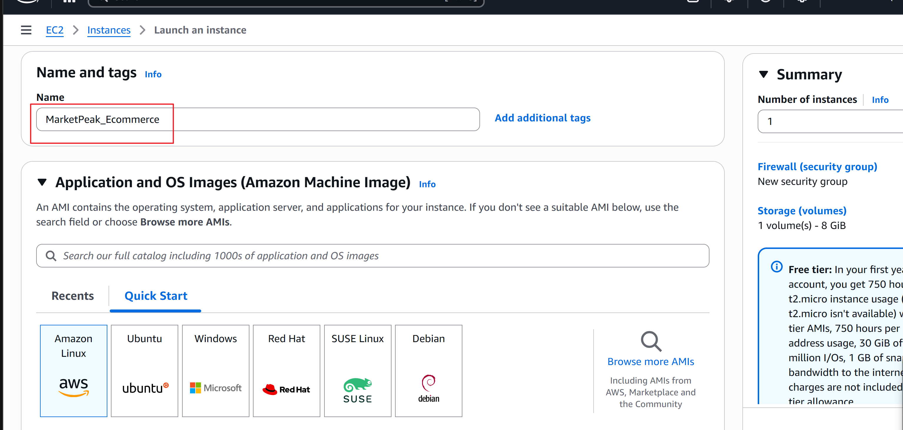
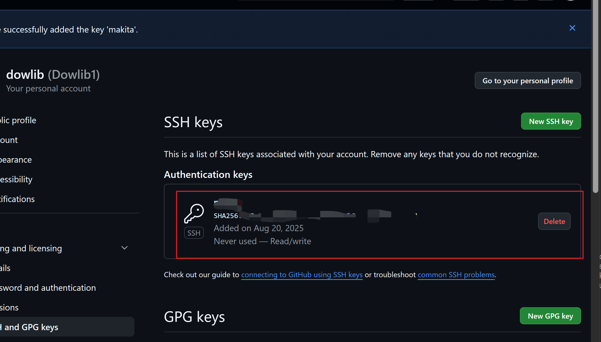
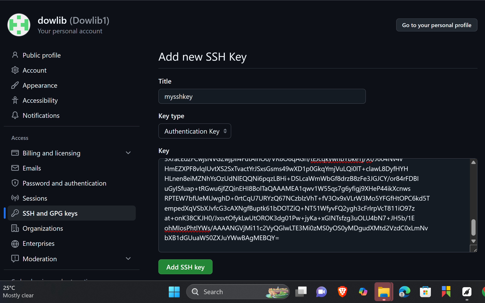

# MarketPeak_Ecommerce
The first instance of MarketPeak_Ecommerce website
# 3MTT MiniProject 

## Project Overview
This repository contains an `website` file for the 3MTT miniProject Deployed with Git, Linux and AWS demonstrating basic deployment website for MArketPeak an Ecommerce Companyand.

#This section documents the Git, linux and aws commands and screenshots for this Project.
 bhmjuk
### example Git Commands Executed
- Initialized repository: `git init` (previously executed)
- Staged `index.html`: `git add .`
- Committed `index.html`: `git commit -m "Genesis code, Add index.html for 3MTT miniProject 2"`
- Verified remote: `git remote -v`
- Pushed to GitHub: `git push -u origin master`
- Added documentation: `git commit -m "Add README with assignment documentation"`
## Step 1
#Initiaize Git Repository
```git
mkdir MarketPeak_Ecommerce
cd MarketPeak_Ecommerce
git init
```


##On github create a repo with the name ' MarketPeak_Ecommerce'


## Obtain your Ecommerce Website Template
🔗 https://www.tooplate.com/view/2130-waso-strategy
##Customize/Edit in your text editor


## Stage and commit the  Template
```
git add .
git config --global user.name "YourUsername"
git config --global user.email "youremail@example.com"
git commit -m "Initial commit with basic e-commerce site structure"
```


##Push tohe code to your Github repository
```
git remote add origin https://github.com/your-git-username/MarketPeak_Ecommerce.git
```
### Deploy on AWS
####Login to your AWS account and Set up an Instance



##Use ssh to connect to  your instace and Clone the repository into the instance using ssh or http.
How to generate  and link ssh-key from your instance to Github
```
cat /home/ubuntu/.ssh/id_rsa.pub

```




```bash
ssh -i /home/mobaxterm/Downloads/key.pem ec2-user@_your-ip-address
```
##Generate an rsa key that connects your instance to your github
```use
rsa-keygen
```


##copy the rsa_key generated on  your instance and past it to your github
###Now use ssh clone url to clone the repository to your instance.
```ssh
git clone git@github.com:yourusername/MarketPeak_Ecommerce.git

```



```HTTPS
git clone https://github.com/yourusername/MarketPeak_Ecommerce.git
```
##Install Apache HTTPS server
Use
```
sudo yum update -y
sudo yum install httpd -y
sudo systemctl start httpd
sudo systemctl enable httpd
```


##Configure httpd for website
```
sudo rm -rf /var/www/html/*
sudo cp -r ~/MarketPeak_Ecommerce/* /var/www/html/
```


 The directory /var/www/html/ is a standard directory structure on Linux systems that host web content, particularly for the Apache HTTP Server

The installation process automatimatically creates this directory  when apache is installed.

##Reload Apache
```
sudo systemctl reload httpd

```


##Acces the website.

#Check for you firewall and security Group rules on aws console if the instace is not reachable via it's  address.

```
Your_instance_ip_address
```


##3 CI/CD workflow
##create a Development branch.
```
git branch development
git checkout development
```


## Addd new featuresin your text editor or make any change


```
git add .
git commit -m "Add new features or fix bugs"
git push origin development
git checkout main
git merge development
git push origin main

```


##Access the website again eith it's IP aaddress in your browser.


### In this project I learnt how to deploy a website on aws using git , linux and CI/CD practices for an ECOMMERCE COMPANY.
### Repository URL
[https://github.com/Dowlib1/Pweb](https://github.com/Dowlib1/MarketPeak_Ecommerce)

